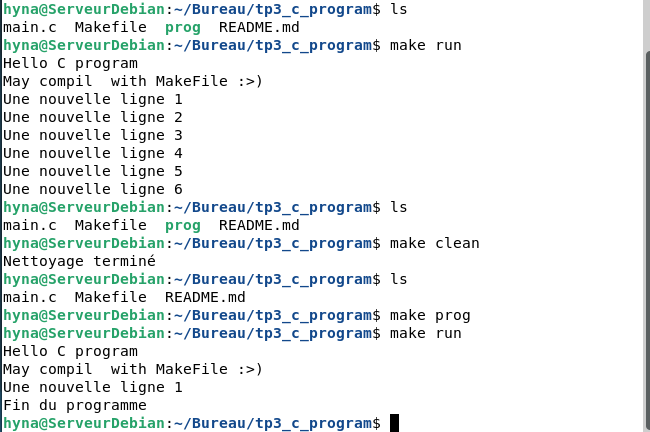

# TP3 - Premier programme C avec Makefile

## Introduction
Un **Makefile** sert à automatiser la compilation. <br/>
La structure d'un Makefile est : <br/>
```
cible : dépendaces
    commande
```

## Rappel des options sur *Makefile*
+ $(VAR) : permet d'utiliser la variable VAR sur notre code
+ @ : devant une commande, empêche l'affiche de l'output de la commande


## Process de compilation via mon Makefile
J'ai commencé par créer un fichier Makefile dans le repo.

Mon objectif est de "décomposer" la commande de compilation vu précédemment (**[b1_gcc_compil](https://github.com/hyna42/tp3_first_c_program/tree/b1_gcc_compil#)**)
`gcc -std=c23 -pedantic -Wall -Wextra -Werror main.c -o prog` en des commandes plus "courtes" et facilement maintenables.

Pour cela j'ai commencé par découper la commande en affectant chaque partie à une **VARIABLE** :
+ **MAIN** = `main.c`
+ **TARGET** = `prog` 
+ **FLAGS** = `-std=c23 -pedantic -Wall -Wextra -Werror`

Ensuite, suivant mes besoins j'ai défini les 3 commandes suivantes dans le Makefile: 

1. Une première commande que je nomme ***prog*** qui va compiler le fichier `main.c` en binaire exécutable : 
    ```
    $(TARGET): $(MAIN)
        @gcc $(FLAGS) $(MAIN) -o (TARGET)
    ```
2. Une seconde commande ***run*** qui va exécuter le binaire précédent obtenu via la commande (prog) :

    ```
    run: $(TARGET)
        @./$(TARGET)
    ```
3. Une dernière commande ***clean*** qui supprime les fichiers binaires générés :

    ```
    clean: $(TARGET)
        @rm -rf $(TARGET)
    ```
## Utilisation
`make prog` : <u>compile</u> le programme et génère l'éxecutable **prog**<br>
`make run` : complile si besoin + <u>lance</u> **./prog**<br>
`make clean` : <u>supprime</u> prog <br><br>
---
