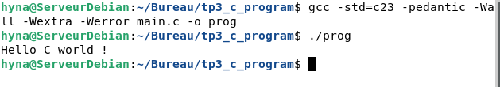

# tp3_first_c_program
- La fonction `main()` est le point d'entrée de notre programme, indispensable en C
- la directive `#include <stio.h>` au tout début du programme , avant la fonction main() est indispensable pour bien compiler en c. Il s'agit d'un instruction du préprocesseur qui indique au compilateur d'inclure le contenu du fichier d'entête stdio.h [Standard Input/Output Header] dans le fichier source actuel avant la compilation

# compilation via gcc
Pour compiler le code depuis la branche b1_gcc_compil j'ai utilise ma commande suivante gcc -std=c23 -pedantic -Wall -Wextra -Werror main.c -o prog

## resultat

